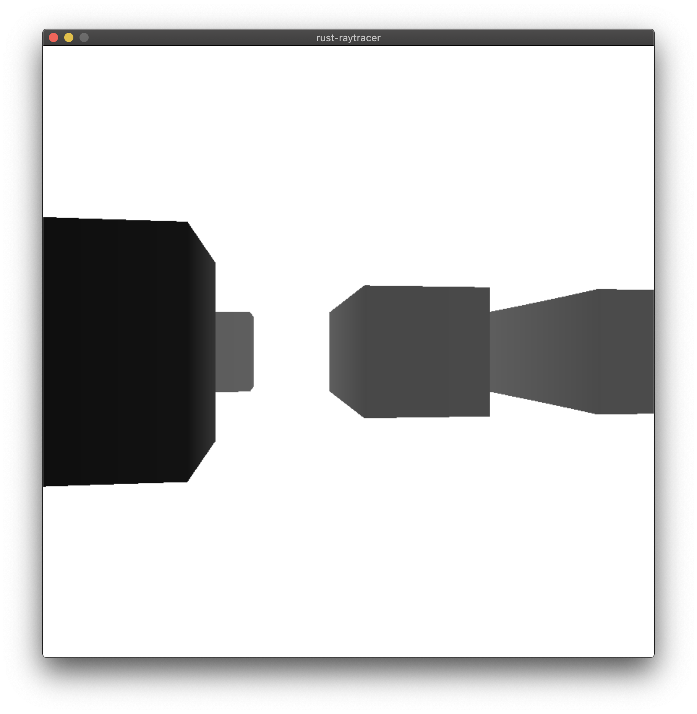

# rust-raytracer

A remake of my Python3 Raytracer in Rust.  Truthfully used it as a means of learning how to write Rust code correctly, but ended up realizing that Rust is leagues faster than Python.  Might end up adding some additional features as I have more skills under my belt + have more performance bandwidth to work with :)

# Screens

  

